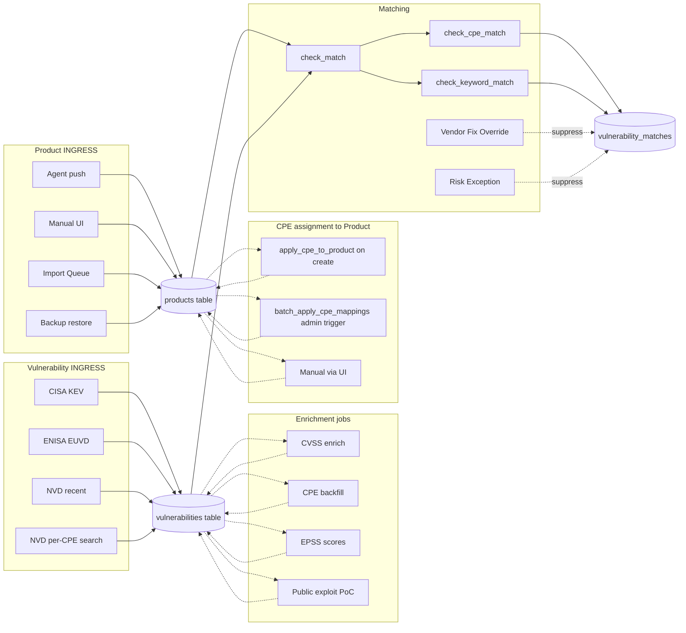
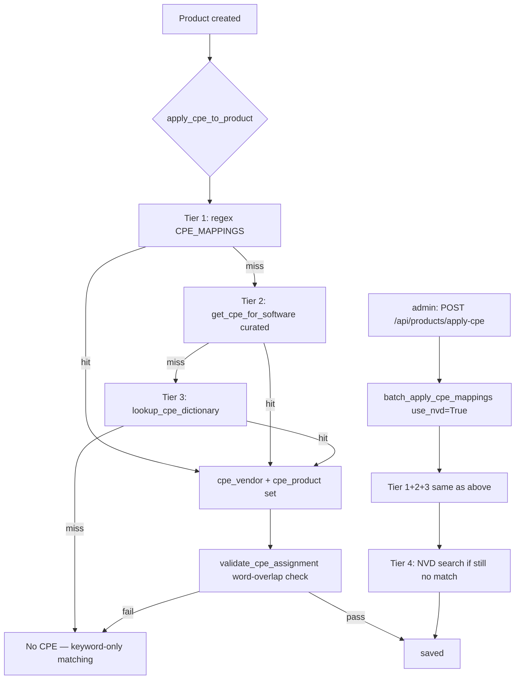
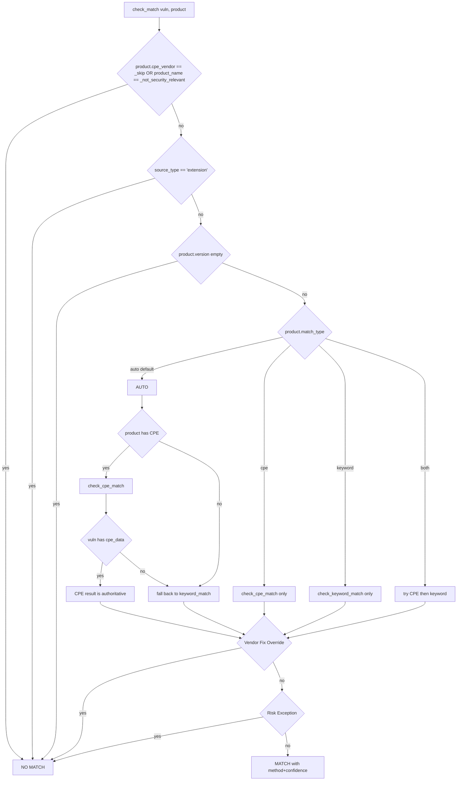

# SentriKat — Architecture Reference

> Internal technical reference for the matching pipeline + data flow + scale considerations.
> **Consolidated 2026-05-07** from 3 source files (CVE-DATA-FLOW + CVE-MATCHING-PIPELINE + SCALE-TESTING-ROADMAP).
> See also: `VULN-FEED-BROKER-DESIGN.md` (kept separate — describes future Q3 broker layer).

## Table of Contents

- [Part 1 — CVE Data Flow](#part-1--cve-data-flow) — how CVEs enter the system + sources
- [Part 2 — CVE Matching Pipeline](#part-2--cve-matching-pipeline) — F.x audit, gaps, fixes
- [Part 3 — Scale Testing Roadmap](#part-3--scale-testing-roadmap) — load + perf benchmarks

---

## Part 1 — CVE Data Flow

# SentriKat — CVE Data Flow Architecture

> Documento di riferimento per capire **come una CVE arriva nella
> dashboard** del customer in SentriKat. Cattura tutti i path possibili
> (sources esterne, agent push, manual add, layers di matching),
> fallback, e i punti dove le cose possono saltare.
>
> Stampa questo documento e attaccalo accanto al monitor: ogni volta
> che un'aggregazione "non si aggiorna" sulla dashboard, parti da qui
> per capire quale step ha saltato.

---

## Vista generale (high level)

```
┌─────────────────────────────────────────────────────────────────────┐
│                  EXTERNAL CVE SOURCES (5)                           │
├─────────────┬───────────────┬─────────────┬───────────┬─────────────┤
│ CISA KEV    │ NVD           │ EPSS        │ ENISA     │ OSV / Vendor│
│ (daily)     │ (real-time +  │ (daily      │ EUVD      │ Advisory    │
│ ~1600 CVE   │  rate-limited)│  scoring)   │           │ feeds       │
└──────┬──────┴───────┬───────┴──────┬──────┴─────┬─────┴──────┬──────┘
       │              │              │            │            │
       ▼              ▼              ▼            ▼            ▼
   ┌──────────────────────────────────────────────────────────────┐
   │              SCHEDULER JOBS (apscheduler)                    │
   │  - "Daily CISA KEV Sync"                                     │
   │  - "NVD Recent CVE Sync (HIGH/CRITICAL + unscored)"          │
   │  - "CVE Description Parser (Awaiting Analysis)"              │
   │  - "CVSS Re-enrichment (upgrade fallback sources to NVD)"    │
   │  - "EPSS Score Refresh"                                      │
   │  - "ENISA EUVD Exploited CVE Sync"                           │
   │  - "Vendor Advisory Sync (OSV, Red Hat, MSRC, Debian)"       │
   │  - "NVD CPE Dictionary Sync (weekly)"                        │
   │  - "SentriKat KB Sync (CPE mappings)"                        │
   │  - "CVE Known Products Cache Refresh"                        │
   │  - "Retry CPE Mapping for Unmapped Products"                 │
   │  - "Patch Tuesday Digest (2nd Wed/month at 09:00)"           │
   └──────────────────────────────────────────────────────────────┘
                              │
                              ▼
              ┌────────────────────────────────┐
              │   DB: vulnerabilities table    │
              │  (cve_id, severity, cvss,      │
              │   affected_product, due_date,  │
              │   ransomware flag, ...)        │
              └────────────────────────────────┘
                              │
                              │  ┌─── inventory in
                              │  │
                              ▼  ▼
   ┌────────────────────────────────────────────────────────────┐
   │       INVENTORY SOURCES (3 paths converge here)            │
   ├──────────────┬──────────────────┬──────────────────────────┤
   │ AGENT PUSH   │ MANUAL UI ADD    │ SEED SCRIPT (dev only)   │
   │ POST         │ POST             │ scripts/seed_e2e_dev.py  │
   │ /api/agent/  │ /api/products    │ direct DB insert         │
   │ inventory    │                  │ + product_organizations  │
   └──────┬───────┴────────┬─────────┴──────┬───────────────────┘
          │                │                │
          ▼                ▼                ▼
       ┌──────────────────────────────────────┐
       │      DB: products table              │
       │  (vendor, name, version, cpe_*,      │
       │   organization_id [legacy single],   │
       │   active, source_type, ...)          │
       └──────────────────────────────────────┘
                          │
                          │ many-to-many via
                          ▼
       ┌──────────────────────────────────────┐
       │   DB: product_organizations table    │ ← THIS is what
       │   (product_id, organization_id)      │   dashboard reads
       │   New multi-org support              │
       └──────────────────────────────────────┘
                          │
                          │ matching engine
                          ▼
       ┌──────────────────────────────────────┐
       │      DB: vulnerability_matches       │
       │  (product_id, vulnerability_id,      │
       │   match_reason, acknowledged, ...)   │
       └──────────────────────────────────────┘
                          │
                          │ aggregations
                          ▼
       ┌──────────────────────────────────────────────────────┐
       │      DASHBOARD ENDPOINTS (read-only)                 │
       │  /api/vulnerabilities/stats                          │
       │  /api/cve-service/status                             │
       │  /api/vulnerabilities (paginated list)               │
       │  /api/products (with vuln_count cached)              │
       └──────────────────────────────────────────────────────┘
                          │
                          ▼
                ┌──────────────────┐
                │   Customer UI    │
                │   (browser)      │
                └──────────────────┘
```

---

## I 3 path inventory in dettaglio

### Path 1 — Agent push (REAL flow customer)

```
[Agent installato su endpoint]
    │
    │ ogni N min, syscall wmic / dpkg / brew → JSON inventory
    │
    ▼
POST /api/agent/inventory
Header: Authorization: Bearer <api_key>
Body: { "products": [{vendor, name, version, ...}],
        "asset": {hostname, os, ...} }
    │
    ▼
[Worker pool supervisor consuma queue]
    │
    ▼
┌─────────────────────────────────────────────────────────────┐
│ FOR EACH product nel payload:                               │
│ 1. UPSERT Product (key: vendor + product_name + org)        │
│ 2. INSERT INTO product_organizations (product, org) ←━━ KEY│
│ 3. UPSERT ProductInstallation (asset, product, version)     │
│ 4. set ProductInstallation.is_vulnerable cache              │
│                                                             │
│ THEN: matching engine                                       │
│ 5. For each new/updated Product:                            │
│    - find vulnerabilities matching cpe_vendor+cpe_product   │
│    - INSERT INTO vulnerability_matches                      │
│ 6. Update ProductInstallation.vulnerability_count cache     │
└─────────────────────────────────────────────────────────────┘
    │
    ▼
[Dashboard query reads product_organizations + vulnerability_matches]
```

### Path 2 — Manual UI Add (admin-driven)

```
Admin → Inventory → Products → Add Product
    │
    ▼
POST /api/products
Body: { vendor, name, version, organization_id }
    │
    ▼
┌─────────────────────────────────────────────────────────────┐
│ 1. INSERT Product                                           │
│ 2. INSERT INTO product_organizations (product, org) ←━━ KEY│
│ 3. Trigger CPE mapping (via SentriKat KB or NVD lookup)    │
│ 4. Run matching engine sync                                 │
│ 5. INSERT vulnerability_matches if any                      │
└─────────────────────────────────────────────────────────────┘
```

### Path 3 — Seed script (DEV ONLY)

```
docker exec sentrikat python3 scripts/seed_e2e_dev.py
    │
    ▼
┌─────────────────────────────────────────────────────────────┐
│ Script generates fake records DIRECTLY in DB:               │
│ 1. INSERT Asset                                             │
│ 2. INSERT Product (sets org_id legacy)                      │
│ 3. INSERT INTO product_organizations ←━━ post-fix 888b841  │
│ 4. INSERT Vulnerability (CVE-2099-*)                        │
│ 5. INSERT VulnerabilityMatch (skip matching engine!)        │
│ 6. INSERT ProductInstallation                               │
│                                                             │
│ NB: SKIPS the matching engine and CPE mapping. The matches  │
│ are pre-computed by the script with random sampling, NOT    │
│ by the actual cpe_vendor+cpe_product algorithm.             │
└─────────────────────────────────────────────────────────────┘
```

**⚠️ Dev-only**: questo path NON è production-realistic. Le match
sono predefinite dallo script, non calcolate dall'engine. Per
testing realistico del matching engine, bisogna usare Path 1 (agent)
o Path 2 (manual add).

---

## Layer di fallback CVSS

Quando una CVE arriva, può non avere CVSS score. SentriKat la "completa"
attraverso layer multipli, in ordine di priorità:

```
1. NVD (autoritativo)
   │
   │ se non disponibile (rate limit / 404 / awaiting analysis):
   ▼
2. CVE.org (mirror official)
   │
   │ se non disponibile:
   ▼
3. ENISA EUVD (european feed)
   │
   │ se non disponibile:
   ▼
4. CISA KEV severity heuristic (CRITICAL se in KEV catalog,
   HIGH default fallback)
   │
   ▼
5. Stored as `severity='UNKNOWN', cvss_score=null`
   - Job "CVSS Re-enrichment" retries periodically
```

Ogni Vulnerability row ha `cvss_source` che dice quale layer ha
prodotto il dato corrente. Questo permette di sapere quanto è
affidabile lo score (e di re-enriccare quando layer più alto torna
disponibile).

---

## Layer di CPE mapping

Quando un Product viene scoperto, deve essere mappato a una CPE
canonica per poter matchare CVE per cpe_vendor+cpe_product:

```
1. SentriKat KB (mapping locale curated)
   │
   │ se miss:
   ▼
2. NVD CPE Dictionary (weekly sync, locale)
   │
   │ se miss:
   ▼
3. Live NVD API lookup (rate-limited, 1-2s/query)
   │
   │ se miss:
   ▼
4. Keyword fallback (greedy text match su Vulnerability.product +
   Product.keywords field)
   │
   ▼
5. Stored as `cpe_vendor=NULL, cpe_product=NULL` (UNMAPPED)
   - Job "Retry CPE Mapping for Unmapped Products" retries
```

**Counter dashboard**: "Products without CPE mapping" mostra layer 5.
Questi sono "blind spots" — il prodotto esiste ma le sue CVE non
vengono trovate finché non viene mappato.

---

## Caching e aggregazioni

Diverse aggregazioni sono **pre-cached** per performance:

| Cache field | Stored on | Updated by |
|---|---|---|
| `Product.vulnerability_count` | Product table | Trigger insert/delete VulnerabilityMatch |
| `ProductInstallation.is_vulnerable` | ProductInstallation | Trigger insert/delete VulnerabilityMatch |
| `ProductInstallation.vulnerability_count` | ProductInstallation | Idem |
| Dashboard stats (in-memory) | Worker process | TTL 60s, recomputed on miss |
| KEV Catalog total | computed live | `Vulnerability.query.count()` (no cache) |

**Trap comuni**:
- Cache stale dopo bulk import: triggers possono perdere row in
  bulk_insert_mappings(). Workaround: trigger manuale di
  re-aggregation post-import.
- Dashboard mostra 0 ma DB ha row: cache TTL sta servendo, refresh
  pagina o aspetta 60s.

---

## Dove le cose si rompono (lessons learned 2026-05)

### Bug `[03.6.7]` — initial-sync 504 timeout
- **Step coinvolti**: setup wizard step 5 chiama sync CISA KEV synchronously
- **Problema**: nginx upstream timeout 120s, sync con CVSS enrichment
  > 120s, frontend riceve HTML 504 page
- **Fix**: sync ora asincrono (job_id + polling progress)

### Bug `[03.20.1]` — Logging silent post-boot
- **Step coinvolti**: tutti i layer Python logging
- **Problema**: alembic.ini ridefiniva root logger durante migration,
  disabilitando tutti gli `app.*` logger
- **Fix**: `disable_existing_loggers=False` in env.py + setup_logging
  re-applied post-stamp

### Bug seed script — product_organizations
- **Step coinvolti**: Path 3 (seed script)
- **Problema**: script popola Product.organization_id (legacy) ma
  NON product_organizations join. Dashboard query usa il join.
- **Fix**: append `org` a `Product.organizations` relationship.

### Bug `[01.18.1]` — Community Edition limits
- **Step coinvolti**: licensing layer
- **Problema**: app/licensing.py LICENSE_TIERS['community'] non
  allineato a quanto promesso dalla landing
- **Fix**: bump a 10/3/100/1 (landing values).

---

## Diagnostica rapida — "perché la dashboard non si aggiorna?"

Step di triage in ordine, da fare quando vedi 0 dove dovrebbe esserci
un numero:

### 1. CVE feed sano?
```sql
SELECT COUNT(*) FROM vulnerabilities;
```
Se 0 → sync CISA KEV non ha mai girato (vedi setup wizard step 5
oppure scheduler logs).

### 2. Products configurati?
```sql
SELECT COUNT(*) FROM products WHERE active = true;
```
Se 0 → nessun inventory yet (no agent installed, no manual add,
no seed).

### 3. **Products linked a org?** ← KEY
```sql
SELECT po.organization_id, COUNT(*)
FROM product_organizations po
GROUP BY po.organization_id;
```
Se 0 row per la tua org → dashboard query ritorna `org_product_ids = []`
→ tutti i counter a 0 anche con altri dati popolati.

### 4. Match esistenti?
```sql
SELECT COUNT(*) FROM vulnerability_matches;
```
Se 0 → matching engine non è girato (forse manca CPE mapping su
products).

### 5. Cache stale?
Refresh pagina / aspetta 60s / restart container per resettare
in-memory cache.

### 6. Org filter attivo?
Dashboard può avere un org-switcher attivo. Verifica che `org_id`
passato al `/api/vulnerabilities/stats` corrisponda all'org dei tuoi
products.

---

## Cross-ref

- `app/scheduler.py` — definizione di tutti i job apscheduler
- `app/cisa_sync.py` — `sync_cisa_kev()` + CPE/CVSS enrichment
- `app/agent_api.py` — `POST /api/agent/inventory` + worker pool
- `app/routes.py` — `/api/vulnerabilities/stats` (dashboard counters)
- `app/models.py` — schema completo (Product, Asset, Vulnerability,
  VulnerabilityMatch, ProductInstallation, product_organizations table)
- `scripts/seed_e2e_dev.py` — seed dev-only (Path 3)
- `docs/e2e-tests/00-INDEX.md` — bug discovery tracker
- `docs/e2e-tests/E2E-FLOWS-INDEX.md` — flow validation tracker

---

**Ultimo update**: 2026-05-05 (post discovery dashboard counter bug nel
seed script + spiegazione layer da utente).


---

## Part 2 — CVE Matching Pipeline

# CVE Matching Pipeline — End-to-End Audit

> **Audience**: anyone trying to answer "is this CVE-on-this-product match correct?"
> **Last updated**: 2026-05-05 — pre-EA hardening pass after live test on Community on-prem (193 product agent push) revealed Chrome 147 ↔ CVE-2010 false positives.
>
> Companion doc: `CVE-DATA-FLOW.md` (high-level data flow). This file is the **operational forensics reference** — every column you need to answer "where did this match come from".

---

## TL;DR — the chain



The pipeline has **four independent failure modes**, any one of which silently degrades quality:

1. **Vulnerability table is sparse** (no CISA/EUVD/NVD recent sync running) → undercoverage
2. **Vulnerability rows lack `cpe_data`** (CPE backfill never ran or stalled) → forced keyword fallback → false positives on legacy CVEs
3. **Product rows lack `cpe_vendor`/`cpe_product`** (regex/dictionary didn't recognize the name AND `batch_apply_cpe_mappings` never ran with NVD fallback) → match cannot use CPE at all → keyword fallback → false positives
4. **Matcher decides keyword fallback when it shouldn't** (logic bug) → false positives even when both sides have CPE

The user-reported case "Chrome 147 ↔ CVE-2010-4204 CRITICAL 9.8" on 2026-05-05 was failure mode (3): all 100 products had `cpe_vendor=NULL` because `apply_cpe_to_product` (called at agent push) uses `use_nvd_fallback=False`, and `batch_apply_cpe_mappings` had never been triggered.

---

## A. Vulnerability INGRESS — who populates the `vulnerabilities` table

| Source | Function | File:line | What it sets | Frequency | Notes |
|---|---|---|---|---|---|
| **CISA KEV** | `parse_and_store_vulnerabilities` | `cisa_sync.py:874` | `cve_id, vendor_project, product, vulnerability_name, date_added, due_date, known_ransomware, is_actively_exploited=True, source='cisa_kev'` | Daily via scheduler | Every CVE imported from KEV is **automatically flagged actively_exploited=True**. This is where the bulk of "is_actively_exploited=358/379" in the user's report came from — it's correct semantically, KEV = exploited by definition. |
| **ENISA EUVD** | enrich loop in `sync_cisa_kev` | `cisa_sync.py:1242–1309` | Creates new Vulnerability rows with `source='euvd'` or upgrades existing to `source='cisa_kev+euvd'`, sets `is_actively_exploited=True` | Same daily run as KEV | Reconciles vendor_project / product info. EUVD-only CVEs come in with `is_actively_exploited=True`. |
| **NVD recent** | `sync_nvd_recent_cves` | `cisa_sync.py:1627` | Pulls CVEs from NVD modified in the last `hours_back` hours; populates cve_id + cpe_data + cvss/severity | Hourly via scheduler | **No flag for actively_exploited** unless the same CVE is later seen by KEV/EUVD. Critical: this is the path that gives us coverage *beyond* exploited. |
| **NVD per-CPE search** | `fetch_cves_by_cpe` | `cisa_sync.py:2276` | Triggered from product page "discover all CVEs for this CPE" UI flow | On demand | Inserts new Vulnerability rows for CVEs not yet in DB but matching a configured CPE. |

### Resulting flag semantics

| Field on `vulnerabilities` | Source of truth | Possible failure modes |
|---|---|---|
| `is_actively_exploited` | True ⟸ CISA KEV ingest, EUVD exploited feed, OR EPSS ≥ 0.95 (see § C) | If NONE of those run, every CVE looks "not exploited" — undercoverage of exploitation signal. |
| `known_ransomware` | True ⟸ CISA KEV `knownRansomwareCampaignUse == 'Known'` | Only KEV entries can carry this flag; non-KEV CVEs always show `false` even if they're tied to ransomware in real life. |
| `severity` | CVSS-derived; multi-step fallback chain (see § C) | NULL when no enrichment ran. **At time of audit: 1583/2284 CVEs (69%) had severity=NULL.** |
| `cpe_data` | Populated by `fetch_cpe_version_data` from NVD CPE Match endpoint | NULL when backfill never ran or stalled. **At time of audit: 1699/2284 CVEs (74%) had cpe_data=NULL.** This is the dominant cause of keyword-fallback false positives. |
| `cpe_fetched_at` | Timestamp of last NVD CPE fetch attempt | NULL ⟹ `check_cpe_match` may fall back to text matching when product has no version (line 197–214 in filters.py). NOT NULL + cpe_data NULL ⟹ NVD authoritatively says "no CPE for this CVE", fallback is suppressed. |
| `nvd_status` | "Awaiting Analysis", "Analyzed", etc. | While "Awaiting", `check_cpe_match` allows weak inference (medium confidence) when product has no version. |
| `epss_score`, `epss_percentile` | `epss_sync.py` | Used by `calculate_priority` only; doesn't affect match decision. |
| `exploit_public` | True ⟸ `exploit_enrichment.py:98` (ExploitDB / GitHub PoC) | Independent from `is_actively_exploited`. PoC exists ≠ exploited in the wild. |

---

## B. Product INGRESS — who populates the `products` table

All fields except CPE are filled at insert time by the source. CPE is added **post-insert** by `apply_cpe_to_product` (best-effort, local lookup only — no NVD).

| Source | File:line | What it sets | CPE applied here? |
|---|---|---|---|
| **Manual UI** `POST /api/products` | `routes.py:1863` | vendor, product_name, version (optional), keywords, criticality, organization_id | ❌ NOT called automatically (gap — see § F.5) |
| **Agent push sync** `report_inventory` | `agent_api.py:2216` | + source='agent', source_type, ecosystem, source_key_type | ✅ `apply_cpe_to_product(product)` at line 2293 (use_nvd_fallback=False) |
| **Agent push async** `process_inventory_job` | `agent_api.py:1551` | same as sync | ✅ at line 1628 (use_nvd_fallback=False) |
| **Import Queue → Product** `create_product_from_queue` | `integrations_api.py:733` | from queue item: vendor, product_name, selected_version, source_type, ecosystem | ❌ NOT called (gap — see § F.5) |
| **Backup restore** | `settings_api.py:2478` | from backup JSON | ❌ NOT called |

### CPE assignment paths



| Function | File:line | Tier coverage | When it runs |
|---|---|---|---|
| `apply_cpe_to_product` | `cpe_mapping.py:349` | 1+2+3 (no NVD) | Each agent push insert |
| `batch_apply_cpe_mappings` | `cpe_mapping.py:408` | 1+2+3+4 (with NVD) | Admin-triggered via `/api/products/apply-cpe` |
| `validate_cpe_assignment` | `cpe_mapping.py` (referenced 393) | sanity check | Every assignment path |
| Manual UI on product detail | `routes.py:update_product` 1932 | n/a — admin types CPE | User edit |

### Why the user saw `with_cpe = 0` on 100 products

The 100 testlab products are auto-detected by Windows agent. Their names are typically things like `Microsoft Windows Desktop Runtime - 8.0.11 (x64)`, `Universal CRT Headers Libraries and Sources`, `Windows SDK`. These don't match any of the regex/dictionary tiers. Agent push uses `use_nvd_fallback=False`, so they fall through to `NoCPE`. **`batch_apply_cpe_mappings` (with NVD) was never triggered**, so the gap was never filled.

---

## C. Enrichment jobs — chronology + responsibility

| Job | Function | Sets | Trigger | Notes |
|---|---|---|---|---|
| CVSS enrich | `enrich_with_cvss_data` | `cvss_score, severity, cvss_source` | Inside `sync_cisa_kev` after KEV ingest | Targets CVEs without CVSS. NVD-rate-limited. |
| CVSS fallback | `reenrich_fallback_cvss` | same fields | On demand | For CVEs that got CVSS from non-NVD source (e.g. EUVD partial) — re-fetch from NVD when available. |
| CPE backfill | `fetch_cpe_version_data` | `cpe_data, cpe_fetched_at, nvd_status` | Inside `sync_cisa_kev` (`cpe_limit=100` per run) AND admin-triggered via `/api/sync/cpe-backfill` | **The single most important enrichment for match accuracy.** Without it, `check_cpe_match` cannot do version range checks → forced keyword fallback. |
| EUVD exploited | `enrich_with_euvd_exploited` | `is_actively_exploited=True` for CVEs in EUVD exploited feed | Inside `sync_cisa_kev` | Adds exploitation signal beyond CISA. |
| EPSS scores | `epss_sync.py` | `epss_score, epss_percentile, epss_fetched_at` | Scheduler | Used by `calculate_priority` only; does NOT cause new matches. EPSS ≥ 0.95 → also flips `is_actively_exploited=True` (per docstring on Vulnerability model). |
| Public exploit | `exploit_enrichment.py:98` | `exploit_public=True, exploit_source, exploit_url` | Scheduler | ExploitDB + GitHub PoC. |

### Severity derivation chain

```
CVSS metric in NVD response → use cvssMetricV31.baseSeverity
  ↳ else use cvssMetricV30.baseSeverity
    ↳ else use cvssMetricV2.baseSeverity
      ↳ else infer via _score_to_severity(cvss_score):
          ≥ 9.0 → CRITICAL, ≥ 7.0 → HIGH, ≥ 4.0 → MEDIUM, else LOW
        ↳ else NULL (no CVSS at all)
```

`severity=NULL` means the CVSS chain never ran. At audit time 69% of vulns had it NULL — diagnostic of an enrichment job that hasn't completed.

---

## D. Matching — `check_match` decision tree



### `check_cpe_match` confidence levels

| Scenario | Returns |
|---|---|
| Product no CPE | `[], None, None` |
| Vuln has cpe_data, ranged entry, version in range | `cpe / high` |
| Vuln has cpe_data, ranged entry, no product version | `cpe / medium` |
| Vuln has cpe_data, ranged entries exist but version OUTSIDE all ranges | `[], None, None` (NOT vulnerable — does NOT fall through to wildcard) |
| Vuln has cpe_data, exact-version entry, exact match | `cpe / high` |
| Vuln has cpe_data, exact-version entry, no product version | `cpe / medium` |
| Vuln has cpe_data, only wildcard entries, product has version | `[], None, None` (skip — too risky) |
| Vuln has cpe_data, only wildcard entries, product no version | `cpe / medium` |
| Vuln no cpe_data, NVD already analyzed (`cpe_fetched_at` set + status not pending) | `[], None, None` (NVD authoritative: no CPE means no CVE applies) |
| Vuln no cpe_data, NVD pending OR never queried, product has version | `[], None, None` (skip — can't verify version) |
| Vuln no cpe_data, NVD pending OR never queried, product no version, vendor+product word-match | `cpe / medium` (CPE inference) |

### `check_keyword_match` confidence levels

| Scenario | Returns |
|---|---|
| Vendor matches AND product matches (word-boundary, +2 word slack) | `vendor_product / medium` ⚠️ **DOES NOT VERIFY VERSION** |
| Only vendor matches (no product configured) | `vendor / medium` |
| Only product matches (no vendor configured) | `product / medium` |
| Keyword string match (≥3 chars, word boundary) | `keyword / low` |
| No match | `[], None, None` |

**Critical observation**: `check_keyword_match` returns `medium` confidence even though it ignores version entirely. A medium-confidence match on Chrome will return ALL Chrome CVEs ever published. This is the root cause of the user's 27 Chrome 147 ↔ CVE-2010 matches.

The reason it isn't gated harder: the system relies on `check_match`'s outer `auto`-mode logic (filters.py:582–598) to ONLY fall through to keyword when (a) product has no CPE OR (b) vuln has no cpe_data. With both sides properly enriched, `check_cpe_match` returns first and keyword is never consulted. **The safety property holds when enrichment is complete; it breaks down silently when either side is missing CPE.**

---

## E. Suppression layers

| Layer | Function | What it kills |
|---|---|---|
| Vendor Fix Override | `has_vendor_fix_override` filters.py:384 | When admin (or distro signal) confirms the installed version contains the vendor-specific patch, even if NVD still lists it as affected |
| Risk Exception | `_has_active_risk_exception` filters.py:424 | When org formally accepts the risk for a CVE (asset-specific or org-wide wildcard) |
| Acknowledged | `acknowledged=True` on VulnerabilityMatch | Doesn't suppress the row, but hides it from default dashboard counters |
| Product `_skip` / `_not_security_relevant` CPE flags | filters.py:543–545 | Hard skip — product never enters matching |
| Extension `source_type` | filters.py:550–551 | Browser/IDE extensions never match (they don't have NVD CVEs; matching their name to the host browser produces nonsense like "VS Code Extension X matches CVE-2024-Y on Microsoft Visual Studio") |
| Empty version | filters.py:556–557 | Products without version cannot be matched (would match all-versions-of-X) |

---

## F. Identified gaps and bugs

### F.1 — `apply_cpe_to_product` doesn't try NVD on agent push (silent)

**File**: `agent_api.py:1628`, `agent_api.py:2293`, `cpe_mapping.py:349`
**Symptom**: 100/100 products from agent push had `cpe_vendor=NULL`.
**Cause**: `apply_cpe_to_product` runs only Tiers 1–3 (regex + curated dict + local CPE dictionary). NVD search (Tier 4) is in `batch_apply_cpe_mappings` only, which is admin-triggered.
**Fix options**:
- (A) Background job that periodically runs `batch_apply_cpe_mappings(use_nvd=True)` for products without CPE — recommended.
- (B) Inline NVD lookup at agent push — rejected: blocks agent ingestion on NVD rate-limit.
- (C) Better default mappings for common Windows components (Windows SDK, Visual C++ Redistributable, .NET runtime) → low-effort, high-coverage.

### F.2 — `apply_cpe_to_product` not called on manual UI product creation

**File**: `routes.py:1863` (`create_product`)
**Symptom**: an admin who manually adds "Apache Tomcat 9.0.50" gets zero CVE matches because cpe_vendor stays NULL.
**Fix**: call `apply_cpe_to_product(product)` after `db.session.add(product)` in `routes.py` `create_product`.
**Status**: ✅✅ **FIXED + VERIFIED LIVE 2026-05-06** (commit `592bffb` on branch `claude/cve-validation-PeN1z`). Manual creation of "Apache Tomcat 9.0.50" via UI assigns `cpe_vendor=apache, cpe_product=tomcat`, immediate match cycle returns 3 valid CVEs (CVE-2025-24813 Path Equivalence KEV, CVE-2023-44487 HTTP/2 Rapid Reset KEV, CVE-2025-0411 carryover) all `cpe / high` confidence.

### F.3 — `apply_cpe_to_product` not called on Import Queue approval

**File**: `integrations_api.py:733` (`create_product_from_queue`)
**Symptom**: products approved from the import queue go to inventory without CPE → no match.
**Fix**: call `apply_cpe_to_product(product)` after the Product is constructed but before commit.

### F.4 — Backup restore creates products without CPE

**File**: `settings_api.py:2478`
**Symptom**: restore brings products back with stale CPE state (or none if old backup pre-dates CPE fields).
**Fix**: post-restore, run `batch_apply_cpe_mappings` for products with `cpe_vendor IS NULL`.

### F.5 — `validate_cpe_assignment` may strip valid mappings without telling the admin

**File**: `cpe_mapping.py:393–400`
**Symptom**: a regex says "cpe_vendor=apache, cpe_product=tomcat" for product "Apache Tomcat", but if the validator's word-overlap heuristic mis-rejects, the product silently stays CPE-less.
**Fix**: when `validate_cpe_assignment` rejects, log to a `cpe_assignment_failures` table or system_settings JSON so an admin can review. Currently logged only at WARNING level — invisible operationally.

### F.6 — `check_keyword_match` returns `medium` confidence without version check

**File**: `filters.py:374–377`
**Symptom**: Chrome 147 ↔ CVE-2010-4204 reported with `vendor_product / medium` while ignoring version 147.
**Why it isn't catastrophic in theory**: outer `check_match` should only fall through to keyword when CPE matching can't help. **Why it IS catastrophic in practice**: when enrichment isn't fully done (the audit case), keyword fallback kicks in for everything.
**Mitigation options**:
- (A) Gate keyword match on vulnerability age vs product version recency (e.g. don't match a 2010 CVE to a 2024-released product version) — heuristic, brittle.
- (B) Demote `vendor_product` to `low` confidence when version cannot be verified (no cpe_data on either side) — recommended, conservative.
- (C) Hide `low` confidence matches from default dashboard view, surface only on explicit "show all matches" toggle.

### F.7 — `is_actively_exploited` propagates from CISA KEV / EUVD, but the inverse doesn't decay

**File**: `cisa_sync.py:913, 933, 1242, 1309`
**Symptom**: a CVE that was once on CISA KEV but later removed (CISA does occasionally drop entries) keeps `is_actively_exploited=True` forever in our DB.
**Fix**: each CISA KEV sync should reset `is_actively_exploited=False` for entries it's expecting to confirm and only set True for those actually present. Equivalent for EUVD.

### F.8 — `cleanup_invalid_matches` runs after every sync but doesn't re-run when product CPE changes

**File**: `filters.py:736`
**Symptom**: after `batch_apply_cpe_mappings` populates CPE on existing products, the existing keyword-only matches stay around. New (correct) matches are added on next sync, but the old false-positive matches remain.
**Fix**: when `apply_cpe_to_product` flips a product from no-CPE to CPE, trigger `cleanup_invalid_matches` for that product OR delete its current matches and let the next match cycle rebuild them.

### F.9 — Product version "64.44.23253" for "Microsoft Windows Desktop Runtime - 8.0.11"

**Source**: agent inventory parse — Windows registry version field for some MSI installers reports the InstallShield build number, not the marketing version.
**Symptom**: matching this product against NVD CPE ranges fails (no NVD entry has version 64.x), so it falls back to keyword and matches every Windows CVE ever.
**Fix**: agent-side parse improvement (extract DisplayVersion / ProductVersion from registry preferentially over Version).

**Status (2026-05-07, post-EA week1 PR)**: ✅ initial hardening landed in `agents/sentrikat-agent-windows.ps1` `Get-NormalizedVersion`. Cascade: `DisplayVersion` (preferred MSI-standard) → packed `Version` DWORD `0xMMmmBBBB` → `MajorVersion + MinorVersion` separate. New payload field `version_source` exposes which signal the agent ended up using; agent log emits per-run breakdown. Server `agent_api.py` ignores unknown fields so backwards-compatible. Long-tail vendors with non-standard registries still need investigation (continue via `version_source=null` reports).

---

## G. Operational checklist (before EA)

To get a clean dashboard on a fresh deployment:

1. **Apply CPE to all products** — `POST /api/products/apply-cpe` (the user's gap was here).
2. **Configure NVD API key** — `system_settings.nvd_api_key`. Without it, backfill takes ~24h.
3. **Run CPE backfill** — `POST /api/sync/cpe-backfill` until idle.
4. **Run CVSS enrich** — `POST /api/sync/cisa-kev` (full sync triggers CVSS too).
5. **Force rematch** — `DELETE FROM vulnerability_matches; ` then re-trigger `match_vulnerabilities_to_products()`.
6. **Validate** — re-run `Validate-CVE.ps1`. Expect:
   - `with_cpe / total_cve` ≥ 80%
   - `with_sev / total_cve` ≥ 80%
   - top 15 matches → `Match=cpe/high` predominant
   - 0 cases of "Chrome 147 + CVE pre-2024"

If all green: ship.


---

## Part 3 — Scale Testing Roadmap

# SentriKat — Scale Testing Roadmap

> Strategia per portare SentriKat dal current state ("easy mode" pre-launch)
> a "enterprise production-ready" attraverso 5 livelli progressivi di
> scale testing.
>
> Documento di riferimento per pianificazione post-launch. **Non** richiede
> azione immediata: il bug fixing functional in corso è il prerequisito
> per arrivare al Livello 1.

---

## Stato attuale (2026-05-04)

### Cosa abbiamo testato finora — "Easy Mode"

| Dimensione | Coverage |
|---|---|
| Functional bug discovery (1-admin, 0-agent) | ✅ ~78% (vedi `docs/e2e-tests/00-INDEX.md` counter) |
| Auth flow E2E (SAML, LDAP, OTP, 2FA, session) | ✅ done (Round 1-6) |
| RBAC matrix base (super_admin, org_admin, user) | ✅ partial (cluster `[06.6.x]`) |
| Setup wizard happy path | ✅ done (`[03.6.3]` verified) |
| Sync CISA/EPSS/CPE/NVD trigger | ✅ done (Round 4 cluster) |
| Integration connectors (Jira/Webhook/GitLab/YouTrack) | ✅ done (testlab MockServer) |
| Settings tabs sub-section | ✅ done (Round 5) |
| Logging + observability resilience | ✅ done (`[03.20.1]` cascade fix) |
| Health checks + notifications | ✅ done (`[03.18.1]` resilience) |
| Cross-repo sync (sentrikat-web admin portal) | ✅ in progress (web team) |

### Cosa NON abbiamo testato — "Easy Mode" gaps

| Dimensione | Status | Why deferred |
|---|---|---|
| Multi-user concurrent (50+ admin) | ❌ | Non rilevante a stage "primi customer pilot" |
| Multi-tenant SaaS scale (100+ org) | ❌ | Idem |
| Agent fleet > 10 endpoint | ❌ | Community license cap impedisce test interno |
| DB dataset > 100K record | ❌ | Tutti i seed test usano DB pulito |
| Long-running sessions (24h+) | ❌ | Memory leak detection richiede setup dedicato |
| Network failure injection | ❌ | Chaos testing è Livello 4 |

**Verdict**: easy mode è solido per **vendita primi 5-20 customer Community/Starter** (fino a ~100 endpoint per cliente). Per customer enterprise (1000+ endpoint) servono Livelli 1-3 prima di firmare contratto.

---

## Roadmap 5 livelli — quando attivare ogni livello

### Trigger by customer profile

| Customer profile | Livelli richiesti prima del go-live |
|---|---|
| Community / Starter (≤ 50 endpoint) | Easy mode ✅ (current) |
| Professional (50-500 endpoint) | + Livello 1 (load test base) |
| Enterprise (500-5000 endpoint) | + Livello 2-3 (DB dataset + fleet sim) |
| Strategic (5000-10000+ endpoint) | + Livello 4 (chaos engineering) |
| Mission-critical / SLA hard | + Livello 5 (pilot) |

### Livello 1 — Synthetic load testing (basic)

**Quando**: prima del primo customer Professional > 50 endpoint.
**Effort**: 1 dev × 3 giorni = 1 settimana cal.
**Repo separato**: `sbr0nch/sentrikat-loadtest` (da creare).

**Tooling**: [k6](https://k6.io/) (Go-based, scripts JavaScript) o [Locust](https://locust.io/) (Python).

**Scenari**:

```js
// k6 example — agent inventory burst
import http from 'k6/http';
import { check, sleep } from 'k6';

export const options = {
  vus: 1000,           // 1000 virtual users
  duration: '5m',
  thresholds: {
    http_req_duration: ['p(95)<500'],  // P95 < 500ms
    http_req_failed: ['rate<0.01'],     // < 1% errors
  },
};

export default function() {
  const payload = JSON.stringify({
    inventory: [/* 50 fake products per submit */]
  });
  const res = http.post('https://app.sentrikat.com/api/agent/inventory',
                        payload,
                        { headers: { Authorization: `Bearer ${__ENV.API_KEY}` }});
  check(res, { 'status 200': (r) => r.status === 200 });
  sleep(60); // realistic 1-min sync interval per agent
}
```

**Misuro**:
- P50/P95/P99 response time per endpoint
- Error rate sotto load
- DB connections used (`SHOW pg_stat_activity`)
- Memory crescita worker gunicorn
- CPU saturation

**Pass criteria**:
- 1000 agent inventory submit/min senza degradation
- Admin dashboard P95 < 1s con 50 admin concurrent
- Zero 5xx errori sotto load nominale
- Memory steady-state (no leak)

**Output deliverable**:
- `sentrikat-loadtest/` repo con scripts riusabili
- Dashboard Grafana con baseline metrics
- Doc "Performance baseline beta.6 release"

---

### Livello 2 — Database scale dataset

**Quando**: prima del primo customer Enterprise > 500 endpoint.
**Effort**: 1 dev × 2 giorni = 1 settimana cal.

**Tooling**: Python script bulk insert + faker + numpy.

**Dataset target**:

| Tabella | Record count target | Justification |
|---|---|---|
| `users` | 5.000 | 100 org × 50 user avg |
| `organizations` | 500 | Mid-market SaaS |
| `endpoints` (tutti tenant) | 50.000 | 100 endpoint avg × 500 org |
| `products` | 200.000 | OS+app inventory realistico |
| `vulnerabilities` (CVE) | 250.000 | Full NVD + CISA + EPSS |
| `affected_endpoint` (join) | 1.000.000 | Dense vuln matching |
| `audit_log` | 5.000.000 | 1 anno operations |
| `inventory_jobs` | 100.000 | Storia agent submission |

**Script structure**:

```python
# scripts/seed_scale_db.py
import os
from faker import Faker
from sqlalchemy import create_engine
from app import db
# ... bulk insert con executemany() o COPY FROM

def seed_organizations(n=500): ...
def seed_users(n=5000): ...
def seed_endpoints(n=50000): ...
def seed_cves(n=250000):
    """Pull real CVE data from local NVD mirror, randomize affected_endpoint"""
    ...
def seed_audit_log(n=5000000):
    """Use INSERT ... SELECT generate_series for speed"""
    ...
```

**Test functional a quella scala**:
- Dashboard load time
- Compliance report generation (timeout?)
- Vulnerability list pagination > 10K row
- Search performance (full-text con GIN index)
- Bulk operations (delete 1000 user, archive 10K vuln)

**Pass criteria**:
- Dashboard P95 < 2s con DB scale
- Compliance report PDF/JSON < 30s per tenant medio
- Search all-vulnerabilities P95 < 1s
- Pagination scroll smooth fino a 100K row

**Output deliverable**:
- `scripts/seed_scale_db.py` parametrico
- Slow query report (`pg_stat_statements`)
- Index recommendations
- Doc "Database scale baseline"

---

### Livello 3 — Fleet simulator (custom tool)

**Quando**: prima del go-live customer 1000+ endpoint.
**Effort**: 1 dev × 5 giorni = 2 settimane cal.

**Tool**: `sentrikat-fleet-sim` — CLI Python che simula N agent reali.

```bash
# Esempio invocazione
sentrikat-fleet-sim \
  --agents 5000 \
  --duration 24h \
  --target https://app.sentrikat.com \
  --api-key-file /etc/sentrikat/keys.txt \
  --inventory-rate "10/agent/h" \
  --jitter 30s \
  --os-distribution "linux:40,windows:35,macos:20,container:5" \
  --failure-rate 0.05 \
  --metrics-port 9090
```

**Comportamento per agent simulato**:
- Inventory submit periodicamente con varianza realistica (Poisson distribution)
- Occasional failure (5% timeout, 1% malformed payload, 0.5% auth error)
- Varied OS distribution con CVE matching realistico
- 1% degli agent va offline per 1-24h (realistic outage)
- Inventory size cresce nel tempo (1 prodotto installato/settimana)

**Esposto su `:9090/metrics`** (Prometheus format):
- `fleet_sim_agents_active` gauge
- `fleet_sim_inventory_submits_total` counter
- `fleet_sim_errors_total` counter per error type
- `fleet_sim_response_time_seconds` histogram

**Lasciato girare 24-72h trova**:
- Memory leak in worker pool
- Scheduler degradation oltre 10K job in queue
- Connection pool exhaustion timing
- DB lock contention durante sync notturno
- Audit log bloat / partition needs

**Pass criteria**:
- 5000 agent simulati per 72h con 0 SLA breach
- Memory steady (RSS crescita < 5%/giorno)
- DB query plan stabile (no degradation)
- Audit log non blocca insert oltre N record

**Output deliverable**:
- `sentrikat-fleet-sim` CLI installabile via pip/docker
- Test runbook 72h
- Doc "Fleet scale validation methodology"

---

### Livello 4 — Chaos engineering

**Quando**: prima del primo customer mission-critical / SLA hard.
**Effort**: 1 dev × 5 giorni + 2 giorni runbook = 2 settimane cal.

**Tooling**: [Chaos Mesh](https://chaos-mesh.org/) (Kubernetes) o `pumba` (Docker) o custom scripts.

**Failure scenarios da testare durante carico Livello 1+3**:

| Failure injection | Atteso behavior | SLA target |
|---|---|---|
| DB primary failover (RDS Multi-AZ) | < 90s recovery, no data loss | < 2 min |
| Network partition app↔license-server | License heartbeat retry, fallback to cached | 0 customer impact |
| Container OOM-killed + auto-restart | New container picks up state, queues drain | < 30s |
| NVD API down per 6h | Sync job queue, retry with backoff | No 5xx exposure |
| CISA feed corrupted (malformed JSON) | Sync rejects + alert, no DB pollution | Manual intervention |
| Disk full /var/log | App continues, log rotation kicks in | < 5min recovery |
| Postgres slow query > 30s | Statement timeout, request 503, no cascade | App stays up |
| Redis (rate limit storage) down | Fallback to in-memory limiter, warn | 0 functional impact |
| 100x normal traffic burst (DDoS-like) | Rate limit kicks in, app stays responsive | < 1% legit user 5xx |

**Output deliverable**:
- `docs/operations/chaos-runbook.md` con ogni scenario step-by-step
- Auto-test in CI (subset di chaos scenarios eseguiti settimanalmente)
- Doc "Resilience SLA evidence"

---

### Livello 5 — Real customer pilot

**Quando**: dopo Livelli 1-4 ✅ + customer design partner trovato.
**Effort**: infra + 1 dev × 4 settimane = 2 mesi cal.

**Setup pilot**:
- Customer con fleet realistico 3000-5000 endpoint
- Production deploy con observability massima:
  - Prometheus + Grafana dashboard
  - PostgreSQL slow query log + EXPLAIN ANALYZE
  - Distributed tracing (OpenTelemetry → Jaeger)
  - Sentry per error reporting
  - Daily/weekly SLA report
- Daily standup con customer ops team
- Bug rate / error rate / SLA tracked

**Outcome target**:
- 30 giorni 99.9% uptime
- Zero data loss events
- Bug discovery rate decrescente (Round 1 trova X, Round 4 trova X/10)
- Customer NPS > 8

**Output deliverable**:
- Case study pubblico (con permesso customer)
- Doc "Production readiness checklist" finalizzata
- GA announcement con baseline performance numbers

---

## Tooling stack consolidato

| Layer | Tool | Purpose |
|---|---|---|
| Load generation | k6 | HTTP load test, multi-VU |
| Fleet simulation | Custom Python | Realistic agent behavior |
| DB seeding | Python + Faker + bulk SQL | Dataset realistico |
| Chaos injection | Chaos Mesh / pumba / custom | Failure scenarios |
| Observability | Prometheus + Grafana + Sentry + OpenTelemetry | Metrics + tracing + errors |
| Slow query analysis | pg_stat_statements + pgBadger | DB profiling |
| Synthetic monitoring | Pingdom / Uptime-Kuma | External SLA proof |
| Penetration testing | OWASP ZAP / Burp Suite | Security audit |

---

## Costo stimato totale (per arrivare a "production-ready enterprise")

| Livello | Effort dev | Calendar | Costo dev (assumendo 80€/h × 7h) |
|---|---|---|---|
| 1 | 3 gg | 1 settimana | ~1.700€ |
| 2 | 2 gg | 1 settimana | ~1.100€ |
| 3 | 5 gg | 2 settimane | ~2.800€ |
| 4 | 7 gg | 2 settimane | ~3.900€ |
| 5 | 4 settimane (28 gg) | 2 mesi | ~15.700€ |
| **Totale** | **~9 settimane dev** | **3-4 mesi cal** | **~25.000€** |

**Più**:
- Infra costs (cloud, monitoring, observability stack): ~500€/mese
- Customer pilot incentive (sconto + supporto dedicato): variabile
- Possibile audit security esterno (penetration test): 5-10K€

**Totale onesto per "GA enterprise certified"**: **35-45K€** + 3-4 mesi.

---

## Quick wins immediati (post-launch easy mode)

Prima del primo customer Professional, low-effort prep:

1. **Setup `sentrikat-loadtest` repo** con skeleton k6/Locust (anche solo 1 scenario base)
2. **Doc "Performance & Scale" su docs.sentrikat.com** Operations section (descrive cosa testiamo a quale tier)
3. **Script `seed_scale_db.py`** parametrico (anche solo 10K endpoint per ora — espandibile)
4. **GitHub Actions workflow** "smoke-load-test" su main: 60s di carico base, blocca PR se P95 > 500ms

Tutti questi 4 = ~2 giorni di lavoro mio in autonomia. Output: hai già la base dell'infrastruttura testing pronta a scalare quando arriva il primo customer enterprise.

---

## Domande aperte (per planning team)

1. **Customer profile target** primi 6-12 mesi: Community/Starter (≤50 endpoint) prevalente o anche Pro/Enterprise?
2. **Budget testing infrastructure** disponibile?
3. **Customer design partner** — c'è qualcuno disposto a fare pilot?
4. **GA target date** — definita?
5. **Penetration testing esterno** — preventivato?

Aggiornare questo doc quando le risposte arrivano. Le risposte cambiano la priorità dei livelli.
