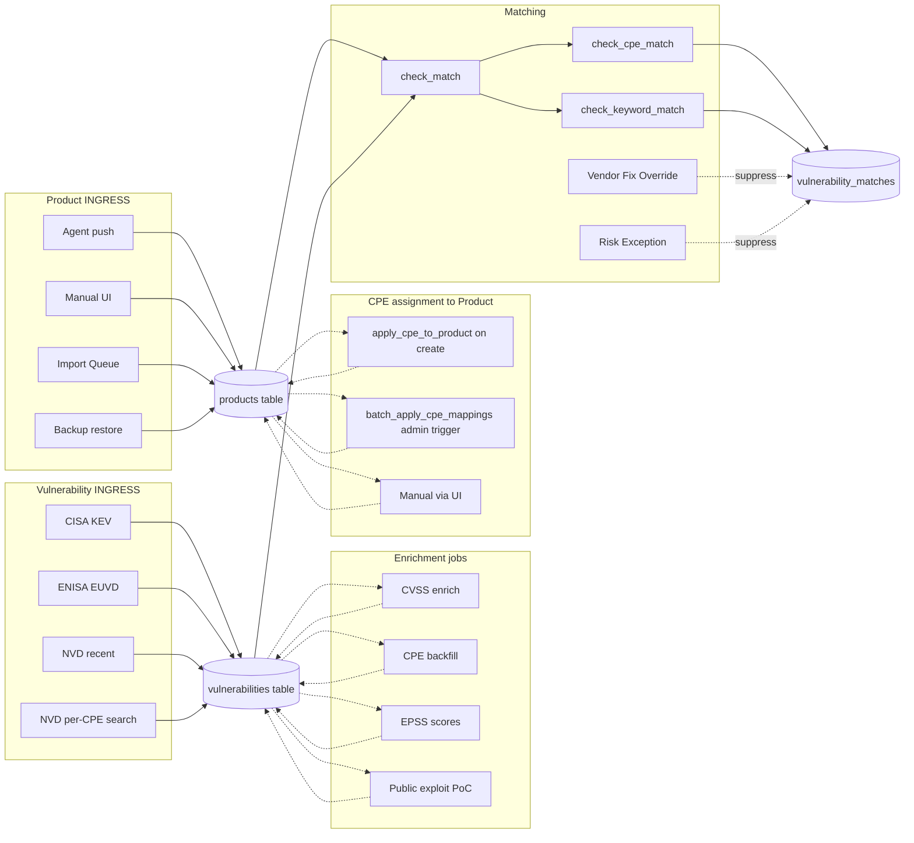
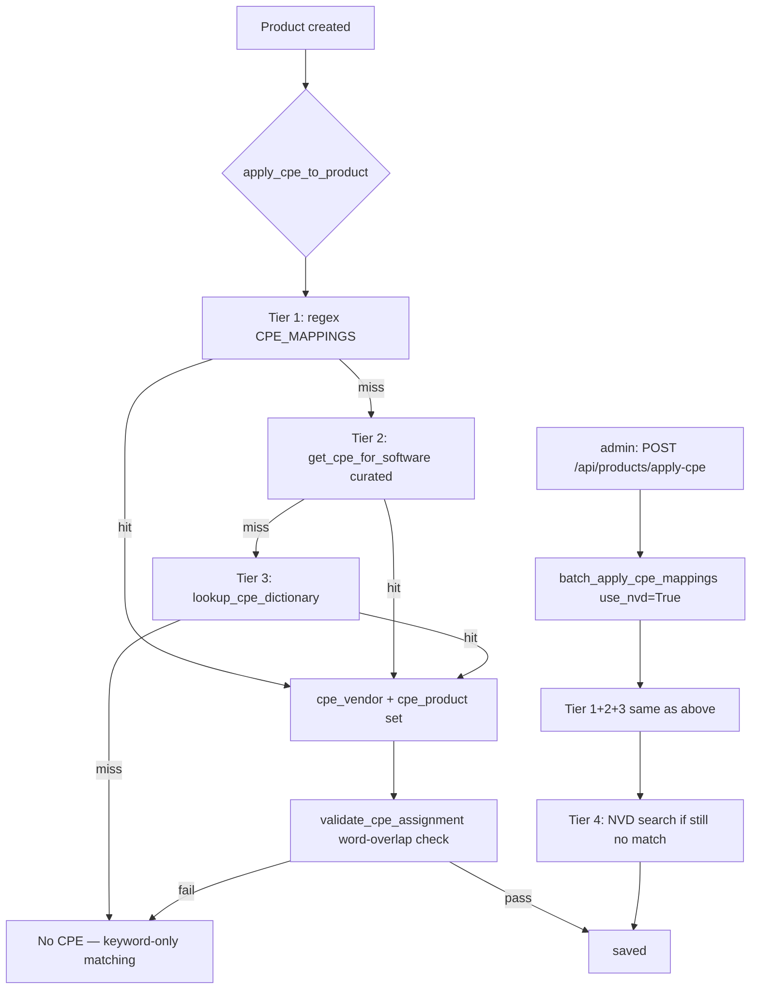
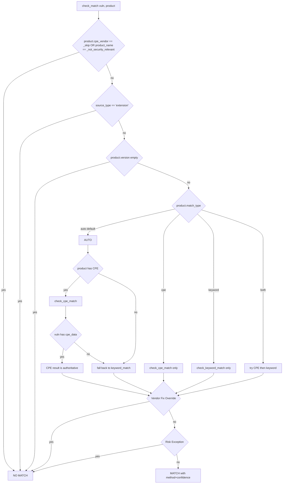

# CVE Matching Pipeline — End-to-End Audit

> **Audience**: anyone trying to answer "is this CVE-on-this-product match correct?"
> **Last updated**: 2026-05-05 — pre-EA hardening pass after live test on Community on-prem (193 product agent push) revealed Chrome 147 ↔ CVE-2010 false positives.
>
> Companion doc: `CVE-DATA-FLOW.md` (high-level data flow). This file is the **operational forensics reference** — every column you need to answer "where did this match come from".

---

## TL;DR — the chain



The pipeline has **four independent failure modes**, any one of which silently degrades quality:

1. **Vulnerability table is sparse** (no CISA/EUVD/NVD recent sync running) → undercoverage
2. **Vulnerability rows lack `cpe_data`** (CPE backfill never ran or stalled) → forced keyword fallback → false positives on legacy CVEs
3. **Product rows lack `cpe_vendor`/`cpe_product`** (regex/dictionary didn't recognize the name AND `batch_apply_cpe_mappings` never ran with NVD fallback) → match cannot use CPE at all → keyword fallback → false positives
4. **Matcher decides keyword fallback when it shouldn't** (logic bug) → false positives even when both sides have CPE

The user-reported case "Chrome 147 ↔ CVE-2010-4204 CRITICAL 9.8" on 2026-05-05 was failure mode (3): all 100 products had `cpe_vendor=NULL` because `apply_cpe_to_product` (called at agent push) uses `use_nvd_fallback=False`, and `batch_apply_cpe_mappings` had never been triggered.

---

## A. Vulnerability INGRESS — who populates the `vulnerabilities` table

| Source | Function | File:line | What it sets | Frequency | Notes |
|---|---|---|---|---|---|
| **CISA KEV** | `parse_and_store_vulnerabilities` | `cisa_sync.py:874` | `cve_id, vendor_project, product, vulnerability_name, date_added, due_date, known_ransomware, is_actively_exploited=True, source='cisa_kev'` | Daily via scheduler | Every CVE imported from KEV is **automatically flagged actively_exploited=True**. This is where the bulk of "is_actively_exploited=358/379" in the user's report came from — it's correct semantically, KEV = exploited by definition. |
| **ENISA EUVD** | enrich loop in `sync_cisa_kev` | `cisa_sync.py:1242–1309` | Creates new Vulnerability rows with `source='euvd'` or upgrades existing to `source='cisa_kev+euvd'`, sets `is_actively_exploited=True` | Same daily run as KEV | Reconciles vendor_project / product info. EUVD-only CVEs come in with `is_actively_exploited=True`. |
| **NVD recent** | `sync_nvd_recent_cves` | `cisa_sync.py:1627` | Pulls CVEs from NVD modified in the last `hours_back` hours; populates cve_id + cpe_data + cvss/severity | Hourly via scheduler | **No flag for actively_exploited** unless the same CVE is later seen by KEV/EUVD. Critical: this is the path that gives us coverage *beyond* exploited. |
| **NVD per-CPE search** | `fetch_cves_by_cpe` | `cisa_sync.py:2276` | Triggered from product page "discover all CVEs for this CPE" UI flow | On demand | Inserts new Vulnerability rows for CVEs not yet in DB but matching a configured CPE. |

### Resulting flag semantics

| Field on `vulnerabilities` | Source of truth | Possible failure modes |
|---|---|---|
| `is_actively_exploited` | True ⟸ CISA KEV ingest, EUVD exploited feed, OR EPSS ≥ 0.95 (see § C) | If NONE of those run, every CVE looks "not exploited" — undercoverage of exploitation signal. |
| `known_ransomware` | True ⟸ CISA KEV `knownRansomwareCampaignUse == 'Known'` | Only KEV entries can carry this flag; non-KEV CVEs always show `false` even if they're tied to ransomware in real life. |
| `severity` | CVSS-derived; multi-step fallback chain (see § C) | NULL when no enrichment ran. **At time of audit: 1583/2284 CVEs (69%) had severity=NULL.** |
| `cpe_data` | Populated by `fetch_cpe_version_data` from NVD CPE Match endpoint | NULL when backfill never ran or stalled. **At time of audit: 1699/2284 CVEs (74%) had cpe_data=NULL.** This is the dominant cause of keyword-fallback false positives. |
| `cpe_fetched_at` | Timestamp of last NVD CPE fetch attempt | NULL ⟹ `check_cpe_match` may fall back to text matching when product has no version (line 197–214 in filters.py). NOT NULL + cpe_data NULL ⟹ NVD authoritatively says "no CPE for this CVE", fallback is suppressed. |
| `nvd_status` | "Awaiting Analysis", "Analyzed", etc. | While "Awaiting", `check_cpe_match` allows weak inference (medium confidence) when product has no version. |
| `epss_score`, `epss_percentile` | `epss_sync.py` | Used by `calculate_priority` only; doesn't affect match decision. |
| `exploit_public` | True ⟸ `exploit_enrichment.py:98` (ExploitDB / GitHub PoC) | Independent from `is_actively_exploited`. PoC exists ≠ exploited in the wild. |

---

## B. Product INGRESS — who populates the `products` table

All fields except CPE are filled at insert time by the source. CPE is added **post-insert** by `apply_cpe_to_product` (best-effort, local lookup only — no NVD).

| Source | File:line | What it sets | CPE applied here? |
|---|---|---|---|
| **Manual UI** `POST /api/products` | `routes.py:1863` | vendor, product_name, version (optional), keywords, criticality, organization_id | ❌ NOT called automatically (gap — see § F.5) |
| **Agent push sync** `report_inventory` | `agent_api.py:2216` | + source='agent', source_type, ecosystem, source_key_type | ✅ `apply_cpe_to_product(product)` at line 2293 (use_nvd_fallback=False) |
| **Agent push async** `process_inventory_job` | `agent_api.py:1551` | same as sync | ✅ at line 1628 (use_nvd_fallback=False) |
| **Import Queue → Product** `create_product_from_queue` | `integrations_api.py:733` | from queue item: vendor, product_name, selected_version, source_type, ecosystem | ❌ NOT called (gap — see § F.5) |
| **Backup restore** | `settings_api.py:2478` | from backup JSON | ❌ NOT called |

### CPE assignment paths



| Function | File:line | Tier coverage | When it runs |
|---|---|---|---|
| `apply_cpe_to_product` | `cpe_mapping.py:349` | 1+2+3 (no NVD) | Each agent push insert |
| `batch_apply_cpe_mappings` | `cpe_mapping.py:408` | 1+2+3+4 (with NVD) | Admin-triggered via `/api/products/apply-cpe` |
| `validate_cpe_assignment` | `cpe_mapping.py` (referenced 393) | sanity check | Every assignment path |
| Manual UI on product detail | `routes.py:update_product` 1932 | n/a — admin types CPE | User edit |

### Why the user saw `with_cpe = 0` on 100 products

The 100 testlab products are auto-detected by Windows agent. Their names are typically things like `Microsoft Windows Desktop Runtime - 8.0.11 (x64)`, `Universal CRT Headers Libraries and Sources`, `Windows SDK`. These don't match any of the regex/dictionary tiers. Agent push uses `use_nvd_fallback=False`, so they fall through to `NoCPE`. **`batch_apply_cpe_mappings` (with NVD) was never triggered**, so the gap was never filled.

---

## C. Enrichment jobs — chronology + responsibility

| Job | Function | Sets | Trigger | Notes |
|---|---|---|---|---|
| CVSS enrich | `enrich_with_cvss_data` | `cvss_score, severity, cvss_source` | Inside `sync_cisa_kev` after KEV ingest | Targets CVEs without CVSS. NVD-rate-limited. |
| CVSS fallback | `reenrich_fallback_cvss` | same fields | On demand | For CVEs that got CVSS from non-NVD source (e.g. EUVD partial) — re-fetch from NVD when available. |
| CPE backfill | `fetch_cpe_version_data` | `cpe_data, cpe_fetched_at, nvd_status` | Inside `sync_cisa_kev` (`cpe_limit=100` per run) AND admin-triggered via `/api/sync/cpe-backfill` | **The single most important enrichment for match accuracy.** Without it, `check_cpe_match` cannot do version range checks → forced keyword fallback. |
| EUVD exploited | `enrich_with_euvd_exploited` | `is_actively_exploited=True` for CVEs in EUVD exploited feed | Inside `sync_cisa_kev` | Adds exploitation signal beyond CISA. |
| EPSS scores | `epss_sync.py` | `epss_score, epss_percentile, epss_fetched_at` | Scheduler | Used by `calculate_priority` only; does NOT cause new matches. EPSS ≥ 0.95 → also flips `is_actively_exploited=True` (per docstring on Vulnerability model). |
| Public exploit | `exploit_enrichment.py:98` | `exploit_public=True, exploit_source, exploit_url` | Scheduler | ExploitDB + GitHub PoC. |

### Severity derivation chain

```
CVSS metric in NVD response → use cvssMetricV31.baseSeverity
  ↳ else use cvssMetricV30.baseSeverity
    ↳ else use cvssMetricV2.baseSeverity
      ↳ else infer via _score_to_severity(cvss_score):
          ≥ 9.0 → CRITICAL, ≥ 7.0 → HIGH, ≥ 4.0 → MEDIUM, else LOW
        ↳ else NULL (no CVSS at all)
```

`severity=NULL` means the CVSS chain never ran. At audit time 69% of vulns had it NULL — diagnostic of an enrichment job that hasn't completed.

---

## D. Matching — `check_match` decision tree



### `check_cpe_match` confidence levels

| Scenario | Returns |
|---|---|
| Product no CPE | `[], None, None` |
| Vuln has cpe_data, ranged entry, version in range | `cpe / high` |
| Vuln has cpe_data, ranged entry, no product version | `cpe / medium` |
| Vuln has cpe_data, ranged entries exist but version OUTSIDE all ranges | `[], None, None` (NOT vulnerable — does NOT fall through to wildcard) |
| Vuln has cpe_data, exact-version entry, exact match | `cpe / high` |
| Vuln has cpe_data, exact-version entry, no product version | `cpe / medium` |
| Vuln has cpe_data, only wildcard entries, product has version | `[], None, None` (skip — too risky) |
| Vuln has cpe_data, only wildcard entries, product no version | `cpe / medium` |
| Vuln no cpe_data, NVD already analyzed (`cpe_fetched_at` set + status not pending) | `[], None, None` (NVD authoritative: no CPE means no CVE applies) |
| Vuln no cpe_data, NVD pending OR never queried, product has version | `[], None, None` (skip — can't verify version) |
| Vuln no cpe_data, NVD pending OR never queried, product no version, vendor+product word-match | `cpe / medium` (CPE inference) |

### `check_keyword_match` confidence levels

| Scenario | Returns |
|---|---|
| Vendor matches AND product matches (word-boundary, +2 word slack) | `vendor_product / medium` ⚠️ **DOES NOT VERIFY VERSION** |
| Only vendor matches (no product configured) | `vendor / medium` |
| Only product matches (no vendor configured) | `product / medium` |
| Keyword string match (≥3 chars, word boundary) | `keyword / low` |
| No match | `[], None, None` |

**Critical observation**: `check_keyword_match` returns `medium` confidence even though it ignores version entirely. A medium-confidence match on Chrome will return ALL Chrome CVEs ever published. This is the root cause of the user's 27 Chrome 147 ↔ CVE-2010 matches.

The reason it isn't gated harder: the system relies on `check_match`'s outer `auto`-mode logic (filters.py:582–598) to ONLY fall through to keyword when (a) product has no CPE OR (b) vuln has no cpe_data. With both sides properly enriched, `check_cpe_match` returns first and keyword is never consulted. **The safety property holds when enrichment is complete; it breaks down silently when either side is missing CPE.**

---

## E. Suppression layers

| Layer | Function | What it kills |
|---|---|---|
| Vendor Fix Override | `has_vendor_fix_override` filters.py:384 | When admin (or distro signal) confirms the installed version contains the vendor-specific patch, even if NVD still lists it as affected |
| Risk Exception | `_has_active_risk_exception` filters.py:424 | When org formally accepts the risk for a CVE (asset-specific or org-wide wildcard) |
| Acknowledged | `acknowledged=True` on VulnerabilityMatch | Doesn't suppress the row, but hides it from default dashboard counters |
| Product `_skip` / `_not_security_relevant` CPE flags | filters.py:543–545 | Hard skip — product never enters matching |
| Extension `source_type` | filters.py:550–551 | Browser/IDE extensions never match (they don't have NVD CVEs; matching their name to the host browser produces nonsense like "VS Code Extension X matches CVE-2024-Y on Microsoft Visual Studio") |
| Empty version | filters.py:556–557 | Products without version cannot be matched (would match all-versions-of-X) |

---

## F. Identified gaps and bugs

### F.1 — `apply_cpe_to_product` doesn't try NVD on agent push (silent)

**File**: `agent_api.py:1628`, `agent_api.py:2293`, `cpe_mapping.py:349`
**Symptom**: 100/100 products from agent push had `cpe_vendor=NULL`.
**Cause**: `apply_cpe_to_product` runs only Tiers 1–3 (regex + curated dict + local CPE dictionary). NVD search (Tier 4) is in `batch_apply_cpe_mappings` only, which is admin-triggered.
**Fix options**:
- (A) Background job that periodically runs `batch_apply_cpe_mappings(use_nvd=True)` for products without CPE — recommended.
- (B) Inline NVD lookup at agent push — rejected: blocks agent ingestion on NVD rate-limit.
- (C) Better default mappings for common Windows components (Windows SDK, Visual C++ Redistributable, .NET runtime) → low-effort, high-coverage.

### F.2 — `apply_cpe_to_product` not called on manual UI product creation

**File**: `routes.py:1863` (`create_product`)
**Symptom**: an admin who manually adds "Apache Tomcat 9.0.50" gets zero CVE matches because cpe_vendor stays NULL.
**Fix**: call `apply_cpe_to_product(product)` after `db.session.add(product)` in `routes.py` `create_product`.
**Status**: ✅✅ **FIXED + VERIFIED LIVE 2026-05-06** (commit `592bffb` on branch `claude/cve-validation-PeN1z`). Manual creation of "Apache Tomcat 9.0.50" via UI assigns `cpe_vendor=apache, cpe_product=tomcat`, immediate match cycle returns 3 valid CVEs (CVE-2025-24813 Path Equivalence KEV, CVE-2023-44487 HTTP/2 Rapid Reset KEV, CVE-2025-0411 carryover) all `cpe / high` confidence.

### F.3 — `apply_cpe_to_product` not called on Import Queue approval

**File**: `integrations_api.py:733` (`create_product_from_queue`)
**Symptom**: products approved from the import queue go to inventory without CPE → no match.
**Fix**: call `apply_cpe_to_product(product)` after the Product is constructed but before commit.

### F.4 — Backup restore creates products without CPE

**File**: `settings_api.py:2478`
**Symptom**: restore brings products back with stale CPE state (or none if old backup pre-dates CPE fields).
**Fix**: post-restore, run `batch_apply_cpe_mappings` for products with `cpe_vendor IS NULL`.

### F.5 — `validate_cpe_assignment` may strip valid mappings without telling the admin

**File**: `cpe_mapping.py:393–400`
**Symptom**: a regex says "cpe_vendor=apache, cpe_product=tomcat" for product "Apache Tomcat", but if the validator's word-overlap heuristic mis-rejects, the product silently stays CPE-less.
**Fix**: when `validate_cpe_assignment` rejects, log to a `cpe_assignment_failures` table or system_settings JSON so an admin can review. Currently logged only at WARNING level — invisible operationally.

### F.6 — `check_keyword_match` returns `medium` confidence without version check

**File**: `filters.py:374–377`
**Symptom**: Chrome 147 ↔ CVE-2010-4204 reported with `vendor_product / medium` while ignoring version 147.
**Why it isn't catastrophic in theory**: outer `check_match` should only fall through to keyword when CPE matching can't help. **Why it IS catastrophic in practice**: when enrichment isn't fully done (the audit case), keyword fallback kicks in for everything.
**Mitigation options**:
- (A) Gate keyword match on vulnerability age vs product version recency (e.g. don't match a 2010 CVE to a 2024-released product version) — heuristic, brittle.
- (B) Demote `vendor_product` to `low` confidence when version cannot be verified (no cpe_data on either side) — recommended, conservative.
- (C) Hide `low` confidence matches from default dashboard view, surface only on explicit "show all matches" toggle.

### F.7 — `is_actively_exploited` propagates from CISA KEV / EUVD, but the inverse doesn't decay

**File**: `cisa_sync.py:913, 933, 1242, 1309`
**Symptom**: a CVE that was once on CISA KEV but later removed (CISA does occasionally drop entries) keeps `is_actively_exploited=True` forever in our DB.
**Fix**: each CISA KEV sync should reset `is_actively_exploited=False` for entries it's expecting to confirm and only set True for those actually present. Equivalent for EUVD.

### F.8 — `cleanup_invalid_matches` runs after every sync but doesn't re-run when product CPE changes

**File**: `filters.py:736`
**Symptom**: after `batch_apply_cpe_mappings` populates CPE on existing products, the existing keyword-only matches stay around. New (correct) matches are added on next sync, but the old false-positive matches remain.
**Fix**: when `apply_cpe_to_product` flips a product from no-CPE to CPE, trigger `cleanup_invalid_matches` for that product OR delete its current matches and let the next match cycle rebuild them.

### F.9 — Product version "64.44.23253" for "Microsoft Windows Desktop Runtime - 8.0.11"

**Source**: agent inventory parse — Windows registry version field for some MSI installers reports the InstallShield build number, not the marketing version.
**Symptom**: matching this product against NVD CPE ranges fails (no NVD entry has version 64.x), so it falls back to keyword and matches every Windows CVE ever.
**Fix**: agent-side parse improvement (extract DisplayVersion / ProductVersion from registry preferentially over Version). Out of scope here, but a top contributor to noise volume.

---

## G. Operational checklist (before EA)

To get a clean dashboard on a fresh deployment:

1. **Apply CPE to all products** — `POST /api/products/apply-cpe` (the user's gap was here).
2. **Configure NVD API key** — `system_settings.nvd_api_key`. Without it, backfill takes ~24h.
3. **Run CPE backfill** — `POST /api/sync/cpe-backfill` until idle.
4. **Run CVSS enrich** — `POST /api/sync/cisa-kev` (full sync triggers CVSS too).
5. **Force rematch** — `DELETE FROM vulnerability_matches; ` then re-trigger `match_vulnerabilities_to_products()`.
6. **Validate** — re-run `Validate-CVE.ps1`. Expect:
   - `with_cpe / total_cve` ≥ 80%
   - `with_sev / total_cve` ≥ 80%
   - top 15 matches → `Match=cpe/high` predominant
   - 0 cases of "Chrome 147 + CVE pre-2024"

If all green: ship.
